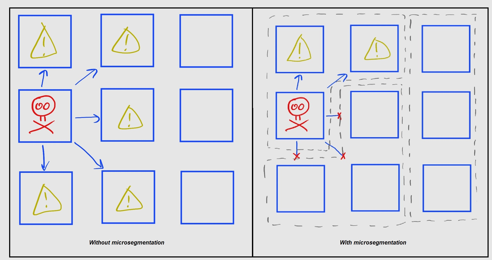

<i>Background</i>

You can find many explanations of microsegmentation on the internet, but I found that most of them fell into one of two categories:

1. the explanation was detailed and correct, but verbose and overly-technical
2. the explanation was concise and easy to understand, but biased towards a particular product

So, I wrote this document to provide a concise, correct, and unbiased definition of microsegmentation. The intended audience for this document is the executive who has some familiarity with basic cybersecurity concepts, but doesn't interact with IT on a daily basis.

 

# Microsegmentation: Executive Summary

This document will define microsegmentation and explain why it is a necessary part of a good network security approach.

## At a glance

* _The problem_: If an attacker compromises a system on your network, they will use that system to launch attacks on other systems within your network. 
* _What microsegmentation is_: Microsegmentation is a network security approach where you enforce security policies on traffic moving within your internal network.
* _How microsegmentation helps_: Microsegmentation limits the scope of security breaches by limiting the systems with which a compromised system can communicate.
* _Challenges of microsegmentation_: Microsegmentation is difficult and time-consuming to implement and maintain.
* _Recommendation_: Microsegmentation is a necessary component of any good network security approach and should be pursued.

## The problem

Traditional network security approaches have relied upon a “hard outer shell”, where border firewalls restrict network traffic moving between your internal network and outside networks. These border firewalls enforce security policies upon **north-south traffic**, or traffic moving between systems on different networks. In a “hard outer shell” approach, you implicitly trust **east-west traffic**, or traffic moving between systems on the same network.

However, the “hard outer shell” approach is not sufficient to prevent cybersecurity breaches. Even with strong perimeter defenses, attackers can breach your internal network through social engineering or other attack vectors which circumvent technical security controls.

If an attacker compromises a system on your network, and your network does not control east-west traffic, then the attacker can use the compromised system to freely launch attacks on other systems inside your network. In this case, a compromised low-security system can be leveraged to compromise a high-security system, which could turn a minor breach into a catastrophic one.

## How microsegmentation can help

**Microsegmentation** is a network security approach where you enforce security policies on east-west traffic, rather than just north-south traffic. When properly implemented, microsegmentation policies only allow the east-west traffic that is absolutely necessary.

If your network has proper microsegmentation, then a compromised system should only be able to communicate with a small group of other systems. Therefore, your network security controls will contain breaches to only this small group, instead of allowing the breach to spread across the rest of your network.

This figure shows the reach of a compromised system in two networks, one without microsegmentation and the other with it.

## Challenges of microsegmentation

The addition of microsegmentation to your network will bring additional challenges with it. Upon initial implementation, it will be a difficult and time-consuming process to define all the necessary traffic flows which should be allowed through your new microsegmentation policies. Additionally, microsegmentation is not a “set it and forget it” solution; you will need to update your microsegmentation policies every time your necessary traffic flows change.

The time and effort required during implementation and maintenance of microsegmentation will scale with the size and complexity of your network.

## Recommendation

Microsegmentation limits the scope of security breaches by restricting nonessential east-west traffic. Although it is difficult and time-consuming to implement and maintain, _microsegmentation is a necessary component of any good network security approach_ as it contains breaches when attackers get past your perimeter defenses.
